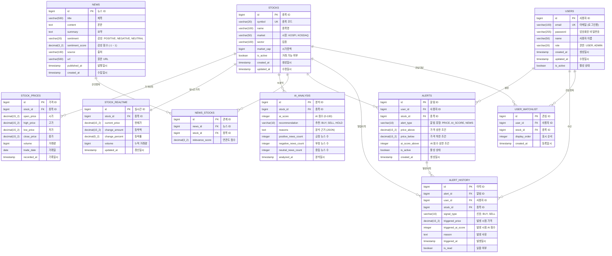

# Stock AI Dashboard - 데이터베이스 ERD

## ERD 다이어그램 (Mermaid)



## 테이블 상세 설명

### 1. USERS (사용자)
- 시스템 사용자 정보를 저장
- JWT 인증에 사용되는 계정 정보 포함

### 2. STOCKS (종목)
- 주식 종목 마스터 데이터
- 종목 코드, 이름, 시장 정보 등 기본 정보

### 3. STOCK_PRICES (주가 이력)
- 일별/분별 OHLCV 데이터 저장
- 캔들 차트 렌더링에 사용

### 4. STOCK_REALTIME (실시간 시세)
- 최신 시세 정보 (Redis에도 캐싱)
- WebSocket을 통해 클라이언트에 푸시

### 5. AI_ANALYSIS (AI 분석)
- AI 서비스의 분석 결과 저장
- 추천 점수, 근거, 뉴스 감성 통계

### 6. NEWS (뉴스)
- 수집된 뉴스 기사 및 감성 분석 결과
- AI 서비스에서 분석한 sentiment 저장

### 7. NEWS_STOCKS (뉴스-종목 관계)
- 뉴스와 관련 종목 간의 다대다 관계
- 연관도 점수로 관련성 표현

### 8. ALERTS (알림 설정)
- 사용자별 알림 조건 설정
- 가격, AI 점수 등 다양한 조건 지원

### 9. ALERT_HISTORY (알림 이력)
- 발생한 알림 기록
- 사용자 알림 목록에 표시

### 10. USER_WATCHLIST (관심 종목)
- 사용자별 관심 종목 목록
- 대시보드에 우선 표시

## 인덱스 전략

```sql
-- 자주 조회되는 컬럼에 인덱스 생성
CREATE INDEX idx_stock_prices_stock_date ON stock_prices(stock_id, trade_date DESC);
CREATE INDEX idx_ai_analysis_stock_date ON ai_analysis(stock_id, analyzed_at DESC);
CREATE INDEX idx_news_published ON news(published_at DESC);
CREATE INDEX idx_news_sentiment ON news(sentiment);
CREATE INDEX idx_alerts_user_active ON alerts(user_id, is_active);
CREATE INDEX idx_alert_history_user_read ON alert_history(user_id, is_read, triggered_at DESC);
```
