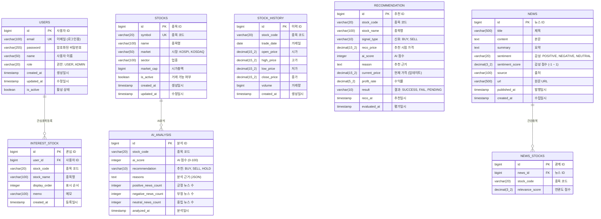

# Stock AI Dashboard - 데이터베이스 ERD

## ERD 다이어그램 (Mermaid)



## 신규 테이블 상세 설명

### STOCK_HISTORY (일봉 데이터)
- 일별 OHLCV(시가, 고가, 저가, 종가, 거래량) 데이터 저장
- 캔들 차트 렌더링에 사용
- **복합 인덱스**: `(stock_code, trade_date)` - 빠른 조회를 위해

### INTEREST_STOCK (관심 종목)
- 사용자별 관심 종목 저장
- `memo` 필드로 개인 메모 가능
- `display_order`로 순서 커스터마이징

### RECOMMENDATION (AI 추천 기록)
- AI가 추천한 종목과 추천 시점 가격 저장
- `profit_rate`: 현재가 대비 수익률
- `result`: 성공(+3% 이상), 실패(-3% 이하), 대기(평가 중)
- **적중률 분석**에 핵심 테이블

## 인덱스 전략

```sql
-- 일봉 데이터 조회 최적화 (복합 인덱스)
CREATE UNIQUE INDEX idx_stock_history_code_date
    ON stock_history(stock_code, trade_date DESC);

-- 관심 종목 조회
CREATE INDEX idx_interest_stock_user
    ON interest_stock(user_id, display_order);

-- AI 추천 적중률 분석
CREATE INDEX idx_recommendation_code_date
    ON recommendation(stock_code, reco_at DESC);
CREATE INDEX idx_recommendation_result
    ON recommendation(result, reco_at DESC);

-- AI 분석 조회
CREATE INDEX idx_ai_analysis_code_date
    ON ai_analysis(stock_code, analyzed_at DESC);
```

## 적중률 계산 로직

```sql
-- 전체 적중률
SELECT
    COUNT(*) as total_count,
    SUM(CASE WHEN result = 'SUCCESS' THEN 1 ELSE 0 END) as success_count,
    ROUND(SUM(CASE WHEN result = 'SUCCESS' THEN 1 ELSE 0 END) * 100.0 / COUNT(*), 2) as hit_rate
FROM recommendation
WHERE result != 'PENDING';

-- 종목별 적중률
SELECT
    stock_code,
    stock_name,
    COUNT(*) as total_count,
    SUM(CASE WHEN result = 'SUCCESS' THEN 1 ELSE 0 END) as success_count,
    ROUND(AVG(profit_rate), 2) as avg_profit_rate
FROM recommendation
WHERE result != 'PENDING'
GROUP BY stock_code, stock_name
ORDER BY success_count DESC;
```
